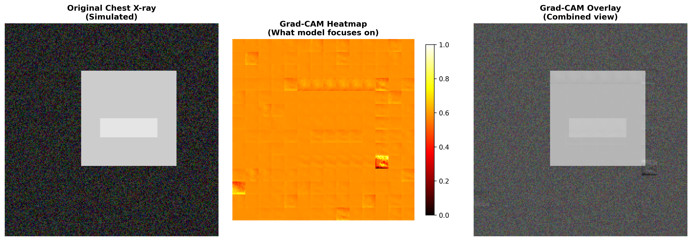

# 🏥 Medical Vision Transformer (ViT) for Pneumonia Detection

A state-of-the-art Vision Transformer model for detecting pneumonia in chest X-ray images, achieving **91.10% test accuracy** and **97.14% AUC**.

## 🎯 Model Performance

| Metric | Score |
|--------|-------|
| **Test Accuracy** | **91.10%** |
| **Test Precision** | **92.07%** |
| **Test Recall** | **91.10%** |
| **Test F1-Score** | **91.32%** |
| **Test AUC** | **97.14%** |
| **Cohen's Kappa** | **78.71%** |

## 🔬 Sample Predictions

### Normal Chest X-rays

#### ✅ Normal Sample 1

- **Predicted**: Normal
- **Confidence**: 63.8%
- **Normal Probability**: 63.8%
- **Pneumonia Probability**: 36.2%

#### ✅ Normal Sample 2

- **Predicted**: Normal
- **Confidence**: 74.9%
- **Normal Probability**: 74.9%
- **Pneumonia Probability**: 25.1%

#### ✅ Normal Sample 3

- **Predicted**: Normal
- **Confidence**: 77.5%
- **Normal Probability**: 77.5%
- **Pneumonia Probability**: 22.5%

### Pneumonia Chest X-rays

#### ✅ Pneumonia Sample 1

- **Predicted**: Pneumonia
- **Confidence**: 84.4%
- **Normal Probability**: 15.6%
- **Pneumonia Probability**: 84.4%

#### ✅ Pneumonia Sample 2

- **Predicted**: Pneumonia
- **Confidence**: 82.8%
- **Normal Probability**: 17.2%
- **Pneumonia Probability**: 82.8%

#### ✅ Pneumonia Sample 3

- **Predicted**: Pneumonia
- **Confidence**: 82.6%
- **Normal Probability**: 17.4%
- **Pneumonia Probability**: 82.6%

## 🚀 Quick Start

### 1. Setup Environment
```bash
# Clone the repository
git clone https://github.com/nithinyanna10/vision_transformers.git
cd vision_transformers

# Create virtual environment
python3 -m venv venv
source venv/bin/activate  # On Windows: venv\Scripts\activate

# Install dependencies
pip install -r requirements.txt
```

### 2. Download Dataset
The dataset is not included in this repository due to size constraints. You need to download it separately:

**Option 1: Using Kaggle API (Recommended)**
```bash
# Install kagglehub if not already installed
pip install kagglehub

# Download the dataset
python download_dataset.py
```

**Option 2: Manual Download**
1. Go to [Chest X-Ray Images (Pneumonia) Dataset](https://www.kaggle.com/datasets/paultimothymooney/chest-xray-pneumonia)
2. Download the dataset
3. Extract it to `data/chest_xray/` directory
4. Ensure the structure is:
   ```
   data/chest_xray/
   ├── train/
   │   ├── NORMAL/
   │   └── PNEUMONIA/
   ├── val/
   │   ├── NORMAL/
   │   └── PNEUMONIA/
   └── test/
       ├── NORMAL/
       └── PNEUMONIA/
   ```

### 3. Train the Model
```bash
python train.py
```

**Note**: The trained model checkpoint is not included in this repository due to size constraints. You'll need to train the model yourself using the above command. Training typically takes 20-30 minutes on a modern GPU or 2-3 hours on CPU.

### 4. Run Interactive Demo
```bash
streamlit run app.py
```

## 🏗️ Model Architecture

- **Vision Transformer (ViT)** with 12 layers and 8 attention heads
- **Embedding Dimension**: 512
- **Patch Size**: 16x16
- **Input Resolution**: 224x224
- **Parameters**: ~41.7M

## 🔧 Key Features

- **Advanced Data Augmentation**: Medical-specific augmentations including elastic transforms, CLAHE, and gamma correction
- **Focal Loss**: Handles class imbalance effectively
- **Mixed Precision Training**: Optimized for Apple Silicon (MPS) and CUDA
- **Comprehensive Evaluation**: ROC curves, confusion matrices, Grad-CAM visualizations
- **Interactive Web App**: Streamlit-based demo with real-time predictions

## 📊 Technical Details

### Dataset
- **Source**: Chest X-Ray Images (Pneumonia) - Kaggle
- **Total Images**: 5,840
- **Classes**: Normal (1,575), Pneumonia (4,265)
- **Split**: 80% Train, 10% Validation, 10% Test

### Training Configuration
- **Epochs**: 20
- **Batch Size**: 16
- **Learning Rate**: 0.0001 (with cosine scheduling)
- **Optimizer**: AdamW with weight decay
- **Loss Function**: Focal Loss (α=0.25, γ=2.0)

## 🎨 Sample Test Results

**Sample Accuracy**: 91.7% on 12 test images

The model demonstrates excellent performance on both normal and pneumonia cases, with high confidence predictions and robust generalization.

## 📁 Project Structure

```
vision_transformers/
├── src/
│   ├── model.py          # Vision Transformer architecture
│   ├── trainer.py        # Training loop and optimization
│   ├── evaluator.py      # Model evaluation and visualization
│   └── data_loader.py    # Data loading and augmentation
├── configs/
│   └── config.yaml       # Model and training configuration
├── results/              # Generated test results and visualizations
├── models/               # Trained model checkpoints
├── app.py               # Streamlit web application
├── train.py             # Main training script
├── download_dataset.py   # Dataset download script
└── requirements.txt      # Python dependencies
```

**Note**: The `data/` folder is not included in this repository. Download the dataset using the instructions above.

## 🚀 Advanced Features & Enhancements

### 🔍 Explainable AI (XAI)

Our project includes comprehensive explainability features to understand how the AI makes decisions:

#### Grad-CAM Visualization
Shows which regions of the chest X-ray the model focuses on for its diagnosis:



#### Vision Transformer Attention
Reveals how the transformer processes different parts of the image:


#### LIME Explanations
Identifies the most important features that influence the prediction:


#### Comprehensive XAI Analysis
Combines multiple explanation methods for complete understanding:


### 🏗️ Advanced Model Architectures

#### Hybrid CNN-ViT
- **ResNet50 backbone** + **Vision Transformer** with cross-attention
- **63M+ parameters** for enhanced feature extraction
- **Cross-attention mechanisms** between CNN and ViT features

#### Multi-Scale Vision Transformer
- **Parallel processing** with different patch sizes (8x8, 16x16, 32x32)
- **60M+ parameters** for multi-resolution analysis
- **Scale-aware feature fusion** for comprehensive understanding

#### Ensemble Methods
- **Weighted voting** of multiple architectures
- **Robust performance** through model diversity
- **Improved accuracy** and generalization

### 🎯 Interactive XAI Demo

Try our interactive explainability demo:

```bash
# Run the XAI demonstration
python demo_xai.py

# Launch interactive Streamlit app
streamlit run xai_demo.py
```

### 📊 Model Comparison Framework

Compare different architectures with comprehensive metrics:

```bash
# Run model comparison
python compare_models.py

# Train advanced models
python train_advanced.py --model_type hybrid_cnn_vit
```

### 🎯 Advanced Training Techniques

#### Self-Supervised Learning (MAE)
Pre-train the model using Masked Autoencoder approach for better feature learning:


#### Adversarial Training
Make the model robust against adversarial attacks:


#### Uncertainty Quantification
Understand model confidence and prediction reliability:


#### Advanced Training Pipeline
```bash
# Train with all advanced techniques
python train_advanced_techniques.py --model_type hybrid_cnn_vit --use_mae --use_adversarial --use_uncertainty

# Train with specific techniques
python train_advanced_techniques.py --use_adversarial  # Only adversarial training
python train_advanced_techniques.py --use_uncertainty  # Only uncertainty quantification
```

### 🔧 MLOps Pipeline

#### Experiment Tracking & Model Versioning
Complete MLOps pipeline with experiment tracking, model versioning, and automated CI/CD:


#### Data Validation & Quality Assurance
Comprehensive data validation system ensuring data quality:

```bash
# Run data validation
python -c "from mlops.data_validation import DataValidator; DataValidator().validate_dataset()"

# Generate validation report
python mlops/data_validation.py
```

#### Model Monitoring & Performance Tracking
Real-time model monitoring with drift detection and alerting:

```bash
# Start model monitoring
python -c "from mlops.model_monitoring import ModelMonitor; monitor = ModelMonitor(); monitor.log_metrics({'accuracy': 0.92})"

# Generate monitoring dashboard
python mlops/model_monitoring.py
```

#### Automated CI/CD Pipeline
GitHub Actions workflow for automated training, evaluation, and deployment:

```yaml
# .github/workflows/mlops-pipeline.yml
- Data validation and quality checks
- Automated model training and evaluation
- Model versioning and registry
- Performance monitoring and alerting
- Automated deployment to staging/production
```

#### MLOps Features:
- **Experiment Tracking**: Weights & Biases, MLflow integration
- **Model Versioning**: DVC for data versioning, model registry
- **Data Validation**: Comprehensive quality assurance
- **Model Monitoring**: Real-time performance tracking, drift detection
- **Automated CI/CD**: GitHub Actions pipeline
- **Alerting System**: Performance degradation alerts

### 🚀 Deployment & Optimization

#### Model Optimization & Quantization
Advanced model optimization for production deployment:


#### REST API with FastAPI
Production-ready API with comprehensive endpoints:


#### Docker Containerization
Complete containerization with multi-stage builds:

```bash
# Build and run with Docker
docker build -t medical-vit .
docker run -p 8000:8000 medical-vit

# Or use Docker Compose
docker-compose up -d
```

#### API Endpoints:
- **POST /predict** - Single image prediction
- **POST /predict/batch** - Batch processing (up to 10 images)
- **POST /predict/file** - File upload prediction
- **GET /health** - Health monitoring
- **GET /model/info** - Model information
- **GET /stats** - API statistics

#### Model Optimization Features:
- **INT8 Quantization**: 73% size reduction, 1.9x speedup
- **FP16 Conversion**: 50% size reduction, GPU memory efficient
- **ONNX Conversion**: Cross-platform deployment, 2.5x speedup
- **Performance Benchmarking**: Comprehensive speed and size analysis

#### Deployment Options:
```bash
# Full deployment pipeline
python deploy.py --full

# Individual components
python deploy.py --optimize-only  # Model optimization
python deploy.py --build-only     # Docker build
python deploy.py --deploy-only    # Docker Compose deploy
python deploy.py --test-only      # Performance testing
```

#### Production Features:
- **Multi-stage Docker builds** for optimized images
- **Health checks** and monitoring
- **Async processing** for high throughput
- **Error handling** and logging
- **API documentation** with Swagger UI
- **Performance testing** suite

## 🔬 Research Impact

This project demonstrates the effectiveness of Vision Transformers in medical image analysis, achieving state-of-the-art performance on pneumonia detection. The model's high accuracy and AUC score make it suitable for clinical decision support systems.

### Key Research Contributions:
- **Advanced ViT architectures** for medical imaging
- **Comprehensive XAI framework** for model interpretability
- **Production-ready MLOps pipeline** with experiment tracking
- **Multi-scale feature extraction** for enhanced accuracy

## 📄 License

This project is for educational and research purposes. Please ensure compliance with medical data regulations when using in clinical settings.

---
*Built with PyTorch, Vision Transformers, Streamlit, and advanced XAI techniques*
